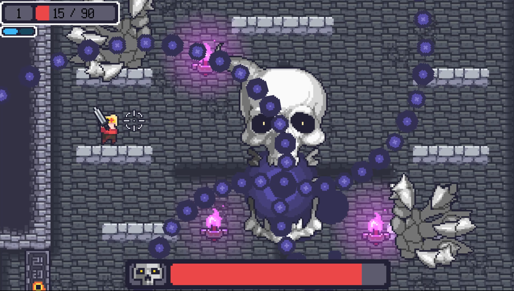

#  🗡️ Dungreed (모작)

🛠️ **개발 도구**
   

📅 **개발 기간**
 24.11.26 ~ 24.12.09 (2주)

🧑‍💻 **개발진**
 

SFML로 제작한 PC 2D 로그라이트 액션 게임 모작 프로젝트입니다.

> 다양한 몬스터를 무찌르며, 다음 스테이지를 향해 끝없이 나아가세요.  
> 플레이어는 근/원거리 무기를 번갈아 사용하며 공격 할 수 있습니다.  
> 원작 던전의 1,2층까지 구현하였습니다.

---

## 🛠️ 주요 구현 요소
<table>
  <tr>
    <td align="center"><strong>무한 스테이지</strong></td>
    <td align="center"><strong>일반 몬스터</strong></td>
  </tr>
  <tr>
    <td align="center">
      

         
        
      

    </td>
    <td align="center">
      

         
        
      

    </td>
  </tr>
</table>

<table>
  <tr>
    <td align="center"><strong>보스</strong></td>
    <td align="center"><strong>플레이어-몬스터 전투</strong></td>
  </tr>
  <tr>
    <td align="center">
      

         
        
      

    </td>
    <td align="center">
      

         
        
      

    </td>
  </tr>
</table>
